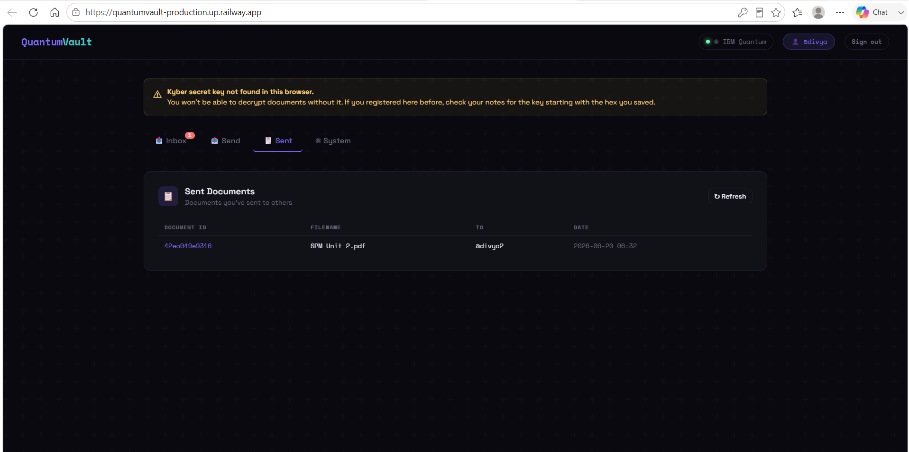
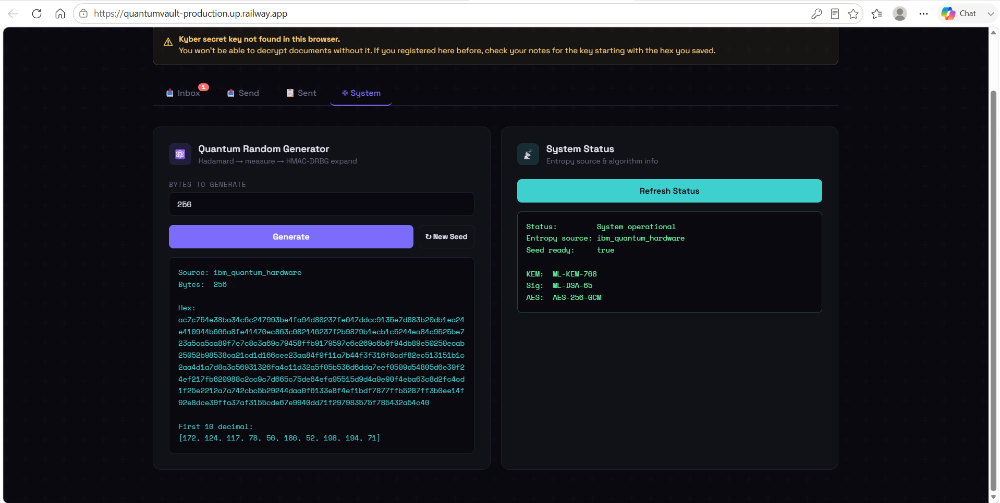
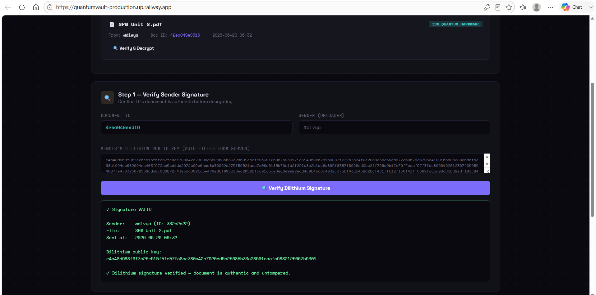
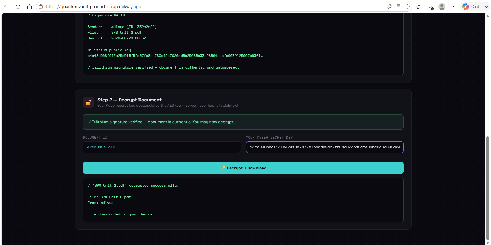

# Post-Quantum Cryptography Implementations

> NIST-standardized post-quantum algorithms implemented in Python and C++, plus **QuantumVault** — a fully functional quantum-safe encrypted document sharing portal.

---

## What's Inside

This repo has two parts:

**1. Algorithm Implementations** — standalone Python and C++ implementations of all three NIST PQC standards using liboqs.

**2. QuantumVault** — a full-stack web app that puts those algorithms to real use: end-to-end encrypted document sharing with quantum-seeded randomness, Kyber key encapsulation, Dilithium signatures, and AES-256-GCM encryption.

---

## Algorithms Implemented

| Algorithm | Standard | Type | Purpose |
|-----------|----------|------|---------|
| ML-KEM-768 (Kyber) | FIPS 203 | Key Encapsulation | Encrypting the AES key to recipient |
| ML-DSA-65 (Dilithium) | FIPS 204 | Digital Signatures | Signing documents and verifying identity |
| SLH-DSA-SHA2-128f | FIPS 205 | Hash-Based Signatures | Stateless hash-based signing |

All three are quantum-resistant — secure against both classical and quantum computers.

---

## QuantumVault — Quantum-Safe Document Portal

### Live Demo
🔗 **[quantumvault-production.up.railway.app](https://quantumvault-production.up.railway.app)**

### What it does

QuantumVault lets users send encrypted files to each other such that:
- Only the intended recipient can decrypt the file
- The server **never sees** the AES key or either secret key in plaintext
- Every key, nonce, and ID is seeded from **real quantum randomness** (IBM Quantum hardware or Qiskit AerSimulator fallback)
- Every encrypted package is **digitally signed** — tampering is detected before decryption

### Crypto Stack

```
Randomness:   IBM Quantum (Hadamard circuit) → HMAC-DRBG expansion
Encryption:   AES-256-GCM  (file content)
Key Wrapping: ML-KEM-768   (Kyber) — wraps the AES key to recipient's public key
Signatures:   ML-DSA-65    (Dilithium) — signs the encrypted package
Storage:      SQLite via SQLAlchemy (secret keys never stored)
```

### Encryption Flow

```
SENDER
  │
  ├─ 1. Dilithium sign filename (identity proof)
  ├─ 2. AES-256-GCM encrypt file with quantum-random key
  ├─ 3. Kyber encapsulate → shared_secret + kyber_ciphertext
  ├─ 4. XOR wrap:  wrapped_aes_key = aes_key ⊕ shared_secret
  ├─ 5. Dilithium sign entire encrypted package
  └─ 6. Store in DB (no raw keys ever stored)

RECIPIENT
  │
  ├─ 1. Verify Dilithium signature (no key needed)
  ├─ 2. Kyber decapsulate → recover shared_secret
  ├─ 3. XOR unwrap: aes_key = wrapped_aes_key ⊕ shared_secret
  └─ 4. AES-GCM decrypt → original file
```

### Key Security Design

- **Kyber secret key** — returned to user once at registration, never stored on server. Saved in browser localStorage.
- **Dilithium secret key** — same. Never stored server-side.
- **AES key** — generated fresh per file, XOR-wrapped with Kyber shared secret, then discarded. Only the wrapped version is stored.
- **Quantum seeding** — the app tries IBM Quantum hardware on startup. Falls back to Qiskit AerSimulator. All randomness (keys, nonces, IDs) flows from this single quantum seed via HMAC-DRBG.

### Screenshots

#### Sender — Signing and Encrypting


#### Quantum RNG — System Status


#### Receiver — Signature Verification


#### Receiver — Decryption


---

## Project Structure

```
post-quantum-cryptography-implementations/
│
├── cpp/                        # C++ implementations
│   ├── kyber/                  # ML-KEM-768
│   ├── dilithium/              # ML-DSA-65
│   └── slh_dsa/                # SLH-DSA-SHA2-128f
│
├── python/                     # Python implementations
│   ├── kyber.py                # ML-KEM-768
│   ├── dilithium.py            # ML-DSA-65
│   └── slh_dsa.py              # SLH-DSA-SHA2-128f
│
├── pqcimp/                     # QuantumVault web app
│   ├── main.py                 # FastAPI backend — all endpoints
│   ├── pqc.py                  # Kyber + Dilithium via liboqs
│   ├── aes_crypto.py           # AES-256-GCM encrypt/decrypt
│   ├── quantum_rng.py          # IBM Quantum + HMAC-DRBG
│   ├── storage.py              # SQLite via SQLAlchemy
│   ├── models.py               # Pydantic request/response models
│   ├── static/
│   │   └── index.html          # Full frontend (single file)
│   └── Dockerfile
│
├── screenshots/
├── requirements.txt
└── README.md
```

---

## Getting Started

### Prerequisites

- Python 3.10+
- [liboqs-python](https://github.com/open-quantum-safe/liboqs-python)
- Docker (optional, for containerized run)
- IBM Quantum account (optional, for real hardware randomness)

### Install Dependencies

```bash
pip install -r requirements.txt
```

`requirements.txt` includes:
```
fastapi
uvicorn
qiskit
qiskit-ibm-runtime
qiskit-aer
git+https://github.com/open-quantum-safe/liboqs-python.git
pycryptodome
python-dotenv
pydantic
python-multipart
sqlalchemy
```

### Environment Variables (optional)

Create a `.env` file in `pqcimp/`:

```env
IBM_QUANTUM_TOKEN=your_token_here
IBM_QUANTUM_INSTANCE=ibm-q/open/main
DATABASE_PATH=quantumvault.db
```

Without `IBM_QUANTUM_TOKEN`, the app automatically falls back to Qiskit AerSimulator for quantum randomness.

### Run Locally

```bash
cd pqcimp
uvicorn main:app --reload --port 8000
```

Visit `http://localhost:8000`

### Run with Docker

```bash
cd pqcimp
docker build -t quantumvault .
docker run -p 8000:8000 quantumvault
```

---

## API Endpoints

| Method | Endpoint | Description |
|--------|----------|-------------|
| GET | `/` | Serves frontend |
| GET | `/status` | Entropy source + algorithm info |
| GET | `/random/bytes?n=32` | Generate quantum-seeded random bytes |
| POST | `/auth/register` | Create account, returns both keypairs |
| POST | `/auth/login` | Verify password, returns user_id |
| GET | `/users/search?q=alice` | Search users by username |
| POST | `/pqc/sign` | Sign a message with Dilithium |
| POST | `/document/upload` | Encrypt and send a file |
| GET | `/documents/inbox/{id}` | List received documents |
| GET | `/documents/sent/{id}` | List sent documents |
| POST | `/document/verify` | Verify Dilithium signature |
| POST | `/document/decrypt` | Decapsulate + decrypt file |

Full interactive docs available at `/docs` (Swagger UI).

---

## Technologies Used

- **Python** + **C++**
- **FastAPI** + **Uvicorn**
- **liboqs** (Open Quantum Safe)
- **Qiskit** + **IBM Quantum**
- **AES-256-GCM** (pycryptodome)
- **SQLite** + **SQLAlchemy**
- **Docker**
- **Railway** (deployment)

---

## References

- [NIST FIPS 203 — ML-KEM](https://csrc.nist.gov/pubs/fips/203/final)
- [NIST FIPS 204 — ML-DSA](https://csrc.nist.gov/pubs/fips/204/final)
- [NIST FIPS 205 — SLH-DSA](https://csrc.nist.gov/pubs/fips/205/final)
- [Open Quantum Safe — liboqs](https://openquantumsafe.org/)
- [IBM Quantum](https://quantum.ibm.com/)

---

